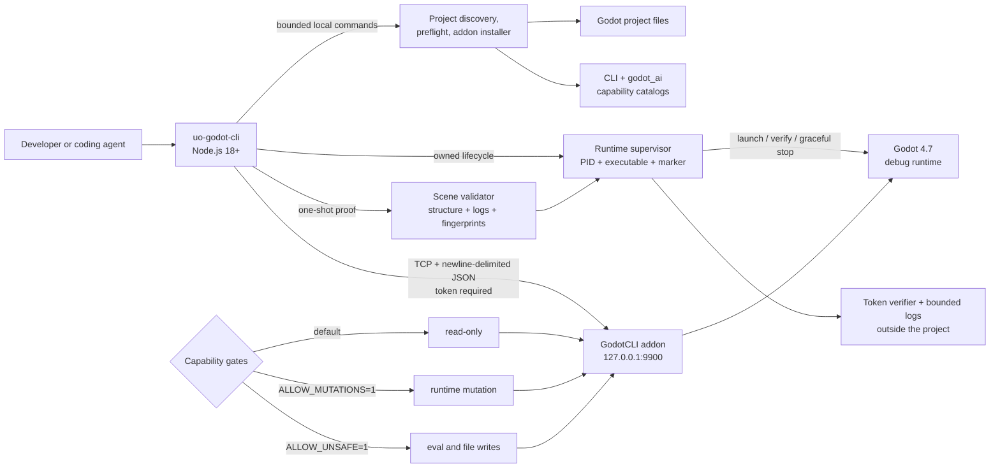

# Ultimate Odycer Godot Runtime CLI

Hardened, local-only runtime control for Godot 4.7 — built for coding agents and deterministic development workflows.

> [!CAUTION]
> This is a **development and testing control plane**, not a gameplay dependency or a production API. The addon refuses release builds and remote network binds.

This repository is Ultimate Odycer's security-focused fork of [mattias800/godot-cli](https://github.com/mattias800/godot-cli). It pairs a Node.js CLI with a Godot addon so an agent or developer can inspect, test, capture, and—only when explicitly enabled—modify a running game.

> [!TIP]
> **Explore the broader project:** [Ultimate Odycer official website](https://www.ultimateodycer.com/) · [Version française](https://www.ultimateodycer.com/fr/)
>
> The public site presents the self-hosted Zig backend, persistent-world vision, Godot integration path, and studio context that this development CLI supports.

The executable is named **`uo-godot-cli`** to avoid colliding with the unrelated `godot-cli` package from [IvanMurzak/Godot-MCP](https://github.com/IvanMurzak/Godot-MCP).

[Why this fork](#why-this-fork) · [Architecture](#architecture) · [Quick start](#quick-start) · [Command guide](#command-guide) · [Security modes](#security-modes) · [Validation evidence](#validation-evidence)

## Why this fork

- **Safe by default:** authenticated, loopback-only, debug-only, and read-only at startup.
- **Fail-closed compatibility:** `doctor` verifies the protocol, addon version, Godot 4.7 runtime, endpoint, limits, and capability gates.
- **Deterministic output:** commands return structured JSON and non-zero exit codes on failed gates or assertions.
- **Bounded inspection:** scene traversal, files, messages, responses, clients, waits, and assertions have explicit limits.
- **No silent activation:** the installer never edits `project.godot` or enables the plugin/autoload.
- **Project-aware preflight:** local discovery and static checks run without starting Godot or requiring a runtime token.
- **Catalog compatibility audit:** compares the bundled CLI manifest with the installed `godot_ai` catalog and requires review for every missing or unmapped capability.
- **Strict process ownership:** managed start, status, logs, and stop verify the token, executable, PID, and a random instance marker.
- **One-shot scene proof:** loads one bounded scene in safe mode, checks structure and logs, fingerprints source files, then stops the owned runtime.
- **Optional FoveaCore bridge:** validated splat discovery and live-scene insertion without saving the scene.

### Choose a workflow

| Goal | Start here | Starts Godot | Token required |
|---|---|---:|---:|
| Audit a project before touching it | `project preflight` | No | No |
| Compare CLI and `godot_ai` capabilities | `project compatibility` | No | Only with `--live` |
| Inspect one addon-manifest v1 file | `mod manifest inspect` | No | No |
| Start and own one local runtime | `runtime start` | Yes | Yes |
| Prove one scene and stop cleanly | `scene validate` | Yes | Yes |
| Run an allowlisted project test | `test list`, then `test run` | Runner-dependent | No runtime token |

## Architecture



The runtime addon exposes 34 protocol commands. `uo-godot-cli commands` returns the live catalog, category, availability, and required gate; treat that response—not a static README list—as the compatibility boundary.

## Requirements

- Godot **4.7.x** debug build; public CI uses **4.7.1 stable** and the full
  local Fovea integration gate currently uses **4.7-dev5**.
- Node.js **18 or newer**.
- A fresh `GODOT_CLI_TOKEN` containing at least 32 characters.
- The same token environment must be present when Godot starts and when the CLI connects.

## Quick start

### 1. Build the local executable

```bash
npm ci --ignore-scripts
npm run build
npm link
uo-godot-cli --version
```

> [!IMPORTANT]
> Do not replace `uo-godot-cli` with the bare `godot-cli` command on a workstation that has Godot-MCP installed; that can invoke a different product with a different protocol and security model.

### 2. Inspect the target project

These commands are local and read-only. They do not start Godot, connect to a runtime, or require a token.

```bash
uo-godot-cli project discover /path/to/game
uo-godot-cli project info /path/to/game
uo-godot-cli project preflight /path/to/game
```

`project preflight` checks the Ultimate Odycer contract: Godot 4.7, Forward+, C#, a main scene, plugin state, the bundled addon, and bounded resource references. It exits non-zero when an error-level check fails or the scan is incomplete.

### 3. Preview and install the addon

```bash
uo-godot-cli addon status /path/to/game
uo-godot-cli addon install /path/to/game --dry-run
uo-godot-cli addon install /path/to/game
```

The installer copies only `addons/godot_cli`, verifies its files, and refuses to overwrite a divergent installation unless `--force` is explicit. It does **not** enable the plugin or modify `project.godot`.

### 4. Create a session token

PowerShell:

```powershell
$uoTokenBytes = New-Object byte[] 32
$uoTokenRng = [Security.Cryptography.RandomNumberGenerator]::Create()
try { $uoTokenRng.GetBytes($uoTokenBytes) } finally { $uoTokenRng.Dispose() }
$env:GODOT_CLI_TOKEN = -join ($uoTokenBytes | ForEach-Object { $_.ToString('x2') })
```

Bash:

```bash
export GODOT_CLI_TOKEN="$(openssl rand -hex 32)"
```

Create a new token for each development session. Never commit it or place it in a shared project configuration.

### 5. Enable and run in Godot

From the same environment that contains the token:

1. Open the project in Godot.
2. Go to **Project → Project Settings → Plugins**.
3. Enable **GodotCLI**.
4. Run the project as a debug build.

Expected startup message:

```text
GodotCLI: Server listening on 127.0.0.1:9900 (read-only mode)
```

After the addon autoload is enabled, the CLI can alternatively own the local
Godot process and its logs:

```bash
uo-godot-cli --port 9900 runtime start /path/to/game --godot /path/to/godot
```

The managed start defaults to headless safe mode and waits for authenticated
readiness. It does not edit or enable the addon.

### 6. Verify the live boundary

```bash
uo-godot-cli wait-for-ready --timeout 30 --interval 250
uo-godot-cli doctor
uo-godot-cli commands
uo-godot-cli scene-tree --depth 3
```

`doctor` rejects protocol/addon mismatches, non-4.7 engines, release builds, non-loopback endpoints, unexpected limits, or elevated gates. Use `doctor --allow-elevated` only when you intentionally enabled a mutation or unsafe session.

## Security modes

| Mode | Environment | Typical capabilities |
|---|---|---|
| Read-only | Default | Inspect nodes and files, structured assertions, validation, readiness, metrics, screenshots |
| Mutating | `GODOT_CLI_ALLOW_MUTATIONS=1` | Change the live scene, simulate input, load scenes, add an unsaved Fovea splat |
| Unsafe | `GODOT_CLI_ALLOW_UNSAFE=1` | Evaluate GDScript, call methods, attach scripts, save scenes, create/delete project files |

Environment gates are read when Godot starts. Restart Godot after changing one.

> [!WARNING]
> Expression-based `assert` and `wait-for` variants execute GDScript and therefore require the unsafe gate. Their structured node/property forms remain available in read-only mode.

See [SECURITY.md](SECURITY.md) for the complete threat boundary and enforced limits.

## Command guide

### Local project and addon commands

```bash
uo-godot-cli project discover [start]
uo-godot-cli project info [start]
uo-godot-cli project preflight [start]
uo-godot-cli project compatibility [start] [--live] [--mcp-port 8000]
uo-godot-cli addon status <project>
uo-godot-cli addon install <project> [--dry-run] [--force]
```

Without `--live`, `project compatibility` is local and tokenless. It compares
bounded, hashed CLI and installed `godot_ai` catalogs by semantic capability
family and emits advisory `cli_runtime`, `mcp_editor`, or context-dependent
routing. Missing, unexpected, oversized, inconsistent, or partially exposed
entries return `review_required`; routing never grants authorization and a
shared family is not a claim that both control planes are behaviorally identical.

`--live` additionally requires `GODOT_CLI_TOKEN`, verifies the local
`godot-ai` identity, reads the authenticated CLI command gates, and lists the
MCP tools with bounded JSON/SSE pagination. It never enables a gate or invokes
an MCP tool.

### Mod manifest structural inspection

```bash
uo-godot-cli mod manifest inspect /path/to/addon-manifest.json
```

The command reads one explicit regular `.json` file (maximum 256 KiB), rejects
symbolic paths and invalid UTF-8, applies bounded JSON traversal, and mirrors
the structural fields, SemVer, token, budget, signature-envelope, and mutable
state rules of Zig2 `addon-manifest` schema v1. Unknown fields and duplicate
signed tokens are deterministic warnings; signed array order is preserved.

Every report deliberately returns `trustVerdict: "not_checked"`,
`packageIntegrity: "not_checked"`, `activationEligible: false`, and
`serverAuthorityRequired: true`. The command does not read a mod package or
trust store, verify Ed25519, install, activate, migrate, roll back, sandbox, or
execute mod code. Only `zig-server-v2` can establish trust and lifecycle state.

### Managed runtime

```bash
uo-godot-cli --port 9900 runtime start [project] --godot /path/to/godot
uo-godot-cli runtime status [project]
uo-godot-cli runtime logs [project] --lines 200 --bytes 65536
uo-godot-cli runtime stop [project] --timeout 10
```

`runtime start` requires Godot 4.7, the exact bundled addon, its explicit
autoload, a free loopback port, and `GODOT_CLI_TOKEN`. It clears inherited
mutation/unsafe gates; use `--allow-mutations` or `--allow-unsafe` only for an
intentional elevated session. `--mode editor` and `--mode game` request visible
development modes, while `--no-wait` returns after ownership registration.

The registry and combined stdout/stderr logs are outside the project under the
operating-system temporary directory. Set `UO_GODOT_CLI_STATE_DIR` to choose a
different regular directory. Five logs are retained per project. The token is
never stored or placed in process arguments: only its SHA-256 verifier is kept.
`runtime stop` refuses to signal a PID unless the token, canonical executable,
and random command-line marker all match. There is no force-kill command.

### One-shot scene validation

```bash
uo-godot-cli --port 9900 scene validate res://scenes/Main.tscn \
  --project /path/to/game --godot /path/to/godot
```

`scene validate` accepts only a regular `.tscn` or `.scn` inside the discovered
project, limited to 64 MiB. It starts an owned headless runtime in safe mode,
runs `doctor` and structural validation, classifies bounded Godot log errors,
fingerprints the scene and `project.godot`, and stops the runtime. The result is
valid only when every stage is complete, both fingerprints are unchanged, and
the logs contain no hard error. Godot may still update generated `.godot`
import/cache data; this command is not GPU, visual-quality, or OpenXR proof.
`valid: false, complete: true` means the full proof ran and found a structural
defect; `complete: false` means the validation evidence itself is incomplete.

### Asset validation

```bash
uo-godot-cli asset validate res://assets/model.glb --project /path/to/game
uo-godot-cli asset validate res://assets/model.gltf --project /path/to/game \
  --policy res://asset-policy.json
uo-godot-cli asset validate res://assets/model.gltf --project /path/to/game \
  --godot-import --godot /path/to/Godot_v4.7-dev5_console
```

`asset validate` is a local, read-only validator for one regular project-local
glTF 2.0 `.gltf` or `.glb`. It closes only declared local buffer/image
dependencies, rejects URLs, data URIs, traversal and symlinks, fingerprints
every accepted source, checks GLB framing and indexed references, and reports
portable topology and bounded PNG/JPEG header metrics. It never scans the whole
project.

Performance limits are enforced only through a closed, versioned
`uo-godot-asset-policy/1` JSON file; the CLI does not invent a headset budget.
`--godot-import` copies the already validated closure to a disposable project,
runs Godot headlessly with XR disabled and a reduced environment, then reports
loaded node/mesh/material/animation/skeleton/body/collision counts. Collision
node presence is not collision-quality proof. `not_requested` means the import
layer did not run; a requested incomplete import returns exit code 1.

Static or isolated import evidence is not GPU, VRAM, visual-quality,
collision-quality, performance, or OpenXR proof. This command validates; it
does not generate LODs, collisions, texture atlases, conversions, signatures,
or mod packages.

### Template registry inspection

```bash
uo-godot-cli template registry inspect /path/to/ultod-json-template-registry
```

This local, tokenless, read-only command verifies catalog v2 structure, known
validation profiles, confined catalog paths, exact full-file SHA-256, the common
contract schema, strict family schema links, strict template identity, and
evidence-bearing `godot-vr` compatibility records. It reads only
`templates/catalog.json` and files named by that catalog; it does not scan the
tree or access the network.

Readiness is deliberately layered. `integrityReady` means the bounded
inspection completed without error. `strictContentReady` additionally requires
at least one verified strict family schema and linked `strict-v1` template.
`consumerReady` additionally requires exact `godot-vr` compatibility evidence.
An integral legacy-only registry returns exit 0 with `consumerReady: false`;
legacy entries and `intended_consumers` hints never count as compatibility.

Inspection does not execute Draft 2020-12, recompute canonical
`spec_checksum`, detect duplicate JSON keys, validate or instantiate a template,
migrate content, run Python/Godot, or prove runtime compatibility. Accordingly,
`template validate`, `instantiate`, and `migrate` are not exposed.

### Project test profiles

```bash
uo-godot-cli test list /path/to/game --godot /path/to/godot
uo-godot-cli test run shaderforge-profile /path/to/game --godot /path/to/godot
```

`test list` reads `.uo-godot-tests.json` without running project code and
reports each profile's entry and dependency availability. `test run` accepts
only a declared profile and supports four direct runners: `godot_scene`,
`godot_script`, `python`, and `dotnet_test`. It never invokes a shell. Godot
profiles always run headless with XR disabled, while Python and .NET execute
the exact in-project `.py` or `.csproj` entry from the manifest.

The schema is versioned and rejects unknown fields, duplicate IDs, traversal,
symbolic entry paths, unsupported extensions, unknown placeholders, excessive
arguments, and timeouts above 900 seconds. `${projectRoot}` and `${godotBin}`
are the only argument placeholders. Output is capped at 1 MiB; timeout or
output overflow stops only the owned child and returns incomplete evidence.
The child receives a reduced environment without `GODOT_CLI_TOKEN` or runtime
mutation gates. Because project-defined tests may legitimately generate cache,
reports fingerprint the manifest and entry file but explicitly label the
project-wide mutation audit as not performed.

The canonical Ultimate Odycer client currently declares six profiles:
`city-runtime`, `scene-contract-static`, `scene-validator-unit`,
`shaderforge-full`, `shaderforge-profile`, and `vr-headless`. Availability does
not imply success: `scene-validator-unit` proves nested-project isolation with
four regression tests, while `scene-contract-static` still returns three real
collision findings and one `load_steps` warning with a failing exit code.

### Readiness and discovery

```bash
uo-godot-cli ping
uo-godot-cli wait-for-ready --timeout 30 --interval 250
uo-godot-cli doctor
uo-godot-cli commands
```

`wait-for-ready` bounds the total wait to 300 seconds and polling intervals to 50–5,000 milliseconds.

### Inspect the running game

```bash
uo-godot-cli scene-tree --root /root/Main --depth 3
uo-godot-cli get-node /root/Main/Player
uo-godot-cli visible-nodes --type Control
uo-godot-cli viewport-info
uo-godot-cli validate-scene
uo-godot-cli screenshot --output gameplay.png
```

`validate-scene` is fail-closed. Traversal is limited to 4,096 nodes and depth 64; truncation returns `complete: false`, `valid: false`, and `validation_budget_exceeded`.

### Structured checks

```bash
uo-godot-cli assert --exists /root/Main/HUD
uo-godot-cli assert --path /root/Main/Player --property visible --equals true
uo-godot-cli wait-for --path /root/Main/Player --property is_on_floor --equals true
uo-godot-cli assert --checks '[
  {"exists":"/root/Main/HUD"},
  {"path":"/root/Main/Player","property":"health","greater_than":0}
]'
```

Batch assertions are limited to 256 checks per request.

### Gated runtime changes

Requires `GODOT_CLI_ALLOW_MUTATIONS=1` before Godot starts:

```bash
uo-godot-cli set-property /root/Main/Player visible false
uo-godot-cli add-node /root/Main Sprite2D --name Marker
uo-godot-cli reparent-node /root/Main/Marker /root/Main/HUD
uo-godot-cli load-scene res://levels/level2.tscn
uo-godot-cli press-key Space
```

### Unsafe operations

Requires `GODOT_CLI_ALLOW_UNSAFE=1` before Godot starts:

```bash
uo-godot-cli eval "get_tree().current_scene.name"
uo-godot-cli call-method /root/Main/Player take_damage 25
uo-godot-cli attach-script /root/Main/Player res://scripts/player.gd
uo-godot-cli attach-script /root/Main/Template res://scripts/template.gd --no-activate
uo-godot-cli create-file res://scripts/generated.gd --content "extends Node"
uo-godot-cli save-scene --path res://scenes/modified.tscn
```

`attach-script` activates the newly attached script by delivering its ready lifecycle, so `_ready()`, `@onready`, and process callbacks are live immediately. Use `--no-activate` only while assembling a scene for a later `save-scene` when running `_ready()` would create nodes that should not be baked into the scene.

For a new scripted node, prefer the one-step form below. It attaches the script before the node enters the tree and therefore requires both the mutation and unsafe gates:

```bash
uo-godot-cli add-node /root/Main --script res://scripts/player.gd --name Player
```

Single-expression `eval` calls return their value automatically. Statement bodies return `null` unless they contain an explicit `return`; assignments are classified as statements without emitting a speculative parse error.

File operations are confined to `res://`; individual files are limited to 4 MiB.

Run `uo-godot-cli --help` or `uo-godot-cli <command> --help` for the complete syntax.

## Optional FoveaCore bridge

When a compatible FoveaCore addon is installed, discovery and validation remain read-only:

```bash
uo-godot-cli fovea status
uo-godot-cli fovea validate
```

Adding a splat requires the mutation gate and an existing `.fovea`, `.ply`, or `.splat` asset inside `res://`:

```bash
uo-godot-cli fovea add /root/Main res://assets/garden.ply \
  --name GardenSplat --quality balanced --opacity 0.85
```

The node is added only to the live scene. Saving remains a separate unsafe operation. `--collisions` is accepted only for native `.fovea` sources, while `--dynamic` opts out of the default static-asset behavior.

The bridge is deterministic and provider-neutral: it does not call Gemini or any other model.

## Configuration and limits

| Setting | Default / limit |
|---|---|
| Bind address | `127.0.0.1` only |
| Port | `9900` |
| Token | 32+ characters |
| Concurrent clients | 8 |
| Unauthenticated timeout | 2 seconds |
| Request / message | 1 MiB |
| Response | 16 MiB |
| Project file | 4 MiB per file |
| Scene traversal | 4,096 nodes, depth 64 |
| Visible-node output | 4,096 nodes |
| Pending waits | 8, up to 300 seconds each |
| Static project scan | 20,000 files, 128 MiB total, 256 reported issues |
| Managed log read | 1 MiB, 2,000 lines |
| Managed log retention | 5 files per project |
| Graceful managed stop | 30 seconds maximum; no force kill |
| One-shot scene source | 64 MiB; regular in-project `.tscn` or `.scn` |
| Scene log diagnostics | 256 errors and 64 warning samples |
| Test manifest | 256 KiB, schema version 1, 128 profiles |
| Test profile arguments | 32 arguments, 1 KiB each, 8 KiB total |
| Test profile execution | 900 seconds and 1 MiB captured output maximum |

Override the port on both sides:

```bash
godot --godot-cli-port=9910
uo-godot-cli --port 9910 doctor
```

Only loopback hosts are accepted. `localhost` is resolved and revalidated before each connection.

## Validation evidence

| Gate | Result | Proof boundary |
|---|---|---|
| Asset + Template + Mod merged integration gate, 2026-08-29 | **139 passed, 0 failed, 0 skipped** | Real Godot 4.7-dev5 disposable asset import, FoveaCore bridge, 6,382-file template registry inspection, strict-to-legacy supersession graph, Zig addon-manifest/trust-store parity, package consumer, runtime and scene validation. This remains local development evidence, not GPU, VRAM, visual-quality, collision-quality, performance, production, or OpenXR proof. |
| Asset validation + Godot 4.7-dev5 local gate, 2026-08-22 | **98 passed, 0 failed, 1 skipped** out of 99 | Static glTF/GLB, dependency, policy, package CLI, real disposable mesh import, collision-required rejection, and canonical source fingerprints. Fovea remained explicitly skipped; this is not GPU, VRAM, visual-quality, collision-quality, performance, or OpenXR proof. |
| Template registry inspection + real registry, 2026-08-23 | **75 passed, 0 failed, 14 skipped** out of 89 | Installed CLI plus two deterministic read-only passes over 4,064 catalogued files; 4,063 legacy, one common strict schema, zero strict templates, integrity ready and consumer not ready. Godot/Fovea tests remained explicitly skipped; inspection is not schema validation, instantiation, migration, or runtime compatibility proof. |
| Default `npm test`, 2026-08-14 | **69 passed, 0 failed, 14 skipped** out of 83 | Build, Node protocol, compatibility catalog, installer, package consumer, project preflight, readiness, security invariants, managed-process controls, test-profile positives/negatives, and local scene-validation negatives. Real Godot and Fovea scenarios were explicitly skipped. |
| Godot 4.7-dev5 local integration gate, 2026-08-14 | **82 passed, 0 failed, 1 skipped** out of 83 | Real headless Godot protocol, managed lifecycle, clean/structural/parse-error scene proofs, and a real `godot_script` test profile. Only the cross-repository FoveaEngine scenario was skipped. |
| Fully configured local integration gate, 2026-08-14 | **83 passed, 0 failed, 0 skipped** with Godot 4.7-dev5 and the local FoveaEngine checkout | CLI/addon runtime, compatibility fail-closed controls, managed-process lifecycle, bounded test profiles, clean/error scene validation, and a temporary one-splat Fovea project; not GPU, visual-quality, production, or OpenXR proof. |
| Canonical test catalog, 2026-08-14 | **6/6 profiles available**; `shaderforge-profile` passed; `scene-validator-unit` passed 4/4; `scene-contract-static` failed closed with 3 errors and 1 warning | Real Godot 4.7-dev5 execution for ShaderForge plus Python positive and negative controls. Nested standalone roots are now isolated; availability is not proof that every profile passes. |
| Canonical compatibility audit, 2026-08-14 | **`ok`, complete**: 34 CLI commands and 43 installed `godot_ai` tools, with no missing or unmapped entries | Static catalog comparison by semantic families only; not runtime availability, behavioral equivalence, or permission equivalence. |
| Canonical `Login.tscn` harness, 2026-08-09 | `doctor` passed; 168 nodes visited; no logged parse/script errors; `project.godot` unchanged | Opt-in, non-persistent read-only harness. The addon remains disabled while `godot_ai` is the active control plane. |
| Canonical static preflight, 2026-08-14 | Correctly failed closed | Found four hard and 375 soft missing references, a 1.51 GB scene outside the scan budget, and an installed but divergent/inactive addon while `godot_ai` remains active. This is evidence of detection, not project readiness. |

The public CI repeats the portable suite on Node.js 18 and 22, then downloads the official Godot 4.7.1 Linux archive, verifies its SHA-256 digest, and runs the real runtime suite. The cross-repository Fovea test remains a separate local gate until FoveaCore is public. Managed-runtime tests use temporary projects and state directories and leave `project.godot` byte-identical.

The 2026-08-14 fully configured rerun used `4.7.dev5.mono.official.a8643700c`.
All 83 tests ran, including the real clean-scene proof, its parse-error negative
control, and a real manifest-driven Godot profile. The FoveaEngine worktree
status was identical before and after the suite, and no managed Godot process
remained.

Pre-release packages use the npm `next` distribution tag through
`publishConfig`; they must not replace `latest` before a stable release is
explicitly approved.

To run the configured integration tests:

PowerShell:

```powershell
$env:GODOT_BIN = 'C:\path\to\Godot_v4.7-dev5_mono_win64.exe'
$env:FOVEA_PROJECT_ROOT = 'F:\foveaengine\fovea-engine'
npm test
```

Bash:

```bash
GODOT_BIN=/path/to/godot \
FOVEA_PROJECT_ROOT=/path/to/fovea-engine \
npm test
```

Headless Godot can exit successfully while still logging a script or resource error. Runtime validation must therefore scan the complete log for `ERROR:`, `SCRIPT ERROR`, parse failures, and load failures; an exit code alone is not sufficient proof.

## Current boundaries

- Persistent activation in the canonical Ultimate Odycer client remains **`[Scaffolding / Proxy]`** while `godot_ai` is enabled; two control planes require distinct ports and tokens.
- Canonical `scene validate` is currently ineligible: the installed GodotCLI copy differs from the bundled addon and its plugin/autoload is disabled. No automatic replacement or activation is performed.
- The same-day canonical `Login.tscn` replay is not promoted because the client reports missing planet, generated-building, and audio resources plus invalid UIDs independently of this addon.
- Static UID discovery cannot validate Godot's binary UID cache; a real runtime scene-load gate is still required.
- The Fovea GDScript fallback proves the bridge contract, not native extension, GPU rendering, visual quality, collision quality, or OpenXR behavior.
- This branch does not ship the unbounded stdio MCP prototype found on other branches. Shell commands and the authenticated TCP protocol remain the supported interfaces.

## Troubleshooting

**`GODOT_CLI_TOKEN must contain at least 32 characters`**

Create a fresh token, export it before starting Godot, and use the same environment for the CLI.

**`doctor` rejects elevated gates**

Restart Godot without mutation/unsafe flags, or explicitly acknowledge the intended development session with `doctor --allow-elevated`.

**Connection refused on port 9900**

Confirm the plugin is enabled, the project is running as a debug build, the token was present at launch, and both sides use the same port.

**`godot-cli` shows different commands**

Run `uo-godot-cli --version`. The bare executable may resolve to Godot-MCP rather than this fork.

**Addon install refuses an existing copy**

Inspect `uo-godot-cli addon status <project>`. Use `--force` only after reviewing the reported divergence.
